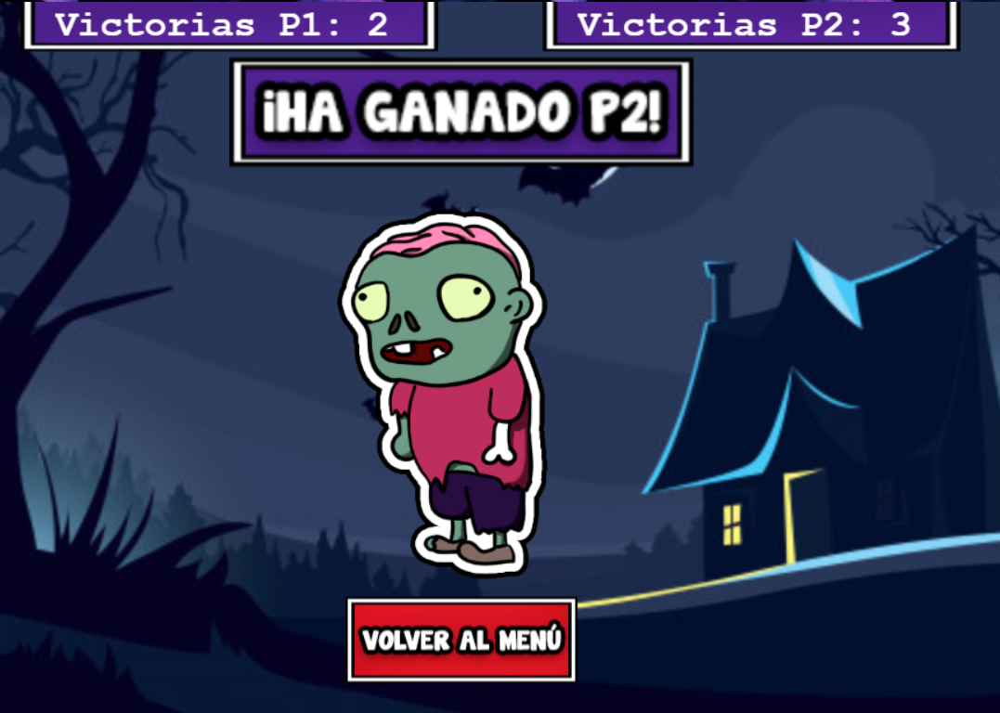

# Juegos en Red
## Datos Básicos
* **Nombre del juego:** Battle-Ween
* **Temática del juego:** Juego tipo "Bomberman" con carácter Battle Royale y ambientación de Halloween.
* **Integrantes del grupo:**
    * Ignacio Molina Casaus.      Github: Darsay.                 Correo: i.molina.2018@alumnos.urjc.es
    * David Ganfornina Alcón.     Github: DavidGanfornina.        Correo: d.ganfornina.2018@alumnos.urjc.es
    * Manuel Rodríguez Bonete.    Github: ManuelRodriguezBonete.  Correo:  m.rodriguezb.2018@alumnos.urjc.es
    * Sonia Oiane Milagro Rubio.  Github: soimiru.                Correo: so.milagro.2018@alumnos.urjc.es
    
* **Trello:** https://trello.com/b/SHQqdxvs/jer-grupo-7

## GDD
### Índice
1. Ficha del juego.
2. Descripción del juego.
3. Mecánicas del juego.
4. Personajes.
5. Controles.
6. Modos de juego.
7. Descripción en un tweet.

### 1. Ficha del juego.
|     Título     | Battle-Ween                                                               |
|:--------------:|---------------------------------------------------------------------------|
|     Género     | Acción                                                                    |
|    Audiencia   | Juventud y jugadores casual                                               |
|   Plataforma   | Pc                                                                        |
| Modos de juego | Battle Royale de 2 a 4 jugadores (ampliable) y cooperativo de 2 jugadores |
|    Temática    | Halloween                                                                 |
|    Estética    | Cartoon / Pixel Art                                                       |

### 2. Descripción del juego.
El juego es una variación del clásico “Bomberman” donde cada jugador controla a un personaje en un gran escenario y su objetivo es matarse entre sí y que solo quede el más fuerte. Cada partida se divide en varios mapas donde cada jugador tendrá la oportunidad de derrotar a sus rivales. Ganará el jugador que al final haya conseguido ganar más mapas.
Los personajes serán 4, cada uno con una habilidad especial, ataque básico y aspecto único. Estos 4 personajes son típicos estereotipos de Halloween, como son “La Bruja”,           “El Zombie”, “El Hombre Lobo” y “El Vampiro”.
Respecto a los escenarios, serán abiertos con obstáculos y “cajas” repartidas alrededor del mismo. El objetivo de las cajas es dar “power-ups” a los personajes, tales como más fuerza, recuperar vida o aumentar su nivel máximo de salud, más velocidad de movimiento o alcance para su ataque.
En cuanto a la experiencia de juego, se requiere que cada mapa no alcance más de 3 minutos de duración y una partida en total consta de 3 a 5 mapas, teniendo una duración completa de unos 10 minutos. Estas partidas serán rápidas y frenéticas haciendo que los jugadores tengan que pensar rápido dónde se moverán o no.
La vista de los jugadores será cenital, se pretende que cada jugador vea todo el mapa y dónde se encuentra el resto de los jugadores. En caso de mapas grandes, la vista seguirá siendo cenital, pero no se verá todo el mapa, sino lo más cercano al jugador.

### 3. Mecánicas del juego
La mecánica principal del videojuego consiste en ser el último jugador vivo en cada mapa, para ello, habrá que acabar derrotando a todos tus enemigos.
	El sistema de combate es sencillo, cada personaje tiene un ataque básico con una distancia y un daño y una habilidad especial única. Si la vida de tu personaje llega a 0, morirás y no podrás volver a jugar hasta el siguiente mapa. Para evitar que esto ocurra, cada jugador podrá resguardarse en las coberturas propias de cada mapa o esquivar con su propio movimiento el proyectil enemigo. 
	En el mapa, encontraremos una serie de cajas con “power-ups” que aumentarán las capacidades del personaje, proporcionándole más vida, daño, alcance, velocidad de movimiento o restaurando su vida.

  
### 4. Personajes
Como previamente se ha dicho, hay 4 personajes distintos teniendo cada uno una cantidad predeterminada de vida, daño, velocidad de movimiento y alcance:

* **Bruja:** La bruja es el personaje principal con más alcance en su ataque básico, no destaca en poder de ataque ni en vida. Su ataque básico es un hechizo de largo alcance, pero no tiene mucho poder de ataque. Su habilidad especial le permite doblar el daño de su próximo ataque básico, con un tiempo de reutilización de 12 segundos.

* **Zombie:** El zombie es el personaje con más daño básico, pero con un alcance bajo. Su habilidad especial le permite aumentar su velocidad de movimiento temporalmente y aumentar el alcance de su ataque básico. El zombie tiene una pasiva extra, que le permite revivir con un 30% de su vida. Esto solo puede ocurrir una vez por cada mapa.

* **Hombre lobo:** El hombre lobo es el personaje con más velocidad base, pero al principio de partida no destaca mucho en ataque ni en alcance. Su habilidad especial es un poco peculiar, durante el primer minuto de partida aún no ha completado su transformación por lo que su daño y alcance están mermados, pero al completarla, aumentará el daño base del personaje y el alcance de su ataque básico.

* **Vampiro:** El vampiro es el personaje más resistente del juego, tendrá puntos de vida extra con respecto a los demás personajes. Su ataque básico consiste en lanzar “sangre” en una dirección, que inflige daño al primer enemigo que golpee, robándole así una pequeña porción de su vida. Su habilidad especial le permite “transformarse” en un charco de sangre que le da velocidad de movimiento extra temporal y le volverá completamente inmune al daño durante 3 segundos. Esta habilidad tiene un tiempo de reutilización de 20 segundos.

### 5. Controles
Para el movimiento **WASD** (arriba, abajo, izquierda y derecha).
Para el ataque básico la tecla “**L**” y para la habilidad especial la tecla “**P**”.

### 6. Modos de juego.
* Battle Royale: de 2 a 4 jugadores (ampliable), donde los jugadores se enfrentarán en mapas abiertos. El objetivo base es eliminar a los demás jugadores, consiguiendo mejoras para tu personaje previamente. El jugador que gane más mapas en una partida, será el vencedor.

* Cooperativo: los jugadores tendrán un tiempo de preparación de 30 segundos para conseguir el máximo número de mejoras posibles. Acabado ese tiempo, empezarán a llegar hordas de enemigos que tendrán que derrotar para vencer. Varias opciones para configurar este modo de juego; derrotar a un número de enemigos, sobrevivir durante un tiempo determinado o modo infinito en el que el objetivo es conseguir sobrevivir durante más tiempo para conseguir más puntuación.

### 7. Descripción en un tweet
Disfruta Halloween con el juego más frenético. Pon a prueba tu habilidad y derrota a tus enemigos. ¿Brujas? ¿Zombies? **¡Battleween ya está aquí!**

### 8. Pantallas
A continuación, se adjuntan todas las pantallas que contiene Battleween:

#### 8.1 Menú Principal

En el menú principal, podemos observar el título del juego además de dos botones que nos dirigirán a las pantallas de juego y del tutorial, todo con música con ambiente "Halloweenesco".

#### 8.2 Tutorial

En el tutorial, podemos observar los controles de ambos jugadores, qué hace cada Power-Up además de una breve descripción del objetivo del juego. En la esquina superior izquierda, hay una tecla de retroceso para volver a la pantalla de menú.

#### 8.3 Juego

En la pantalla de juego, podemos observar el mapa del juego, con nuestros dos personajes, sus respectivas saludes y los power ups repartidos por el mapa junto a una música de combate que empezará a reproducirse. Cada vez que alguien derrote a su adversario, se restaurará la salud y se cargará el nuevo mapa hasta que se jueguen todos ellos y se determine a un ganador, pasando así a la pantalla final.

#### 8.4 Pantalla Final

Tras jugar en todos los mapas, se mostrará esta pantalla con las partidas que ha ganado cada jugador y, en el centro de la pantalla, se visualizará una ilustración del personaje cuyo jugador haya ganado. Finalmente, hay un botón para regresar a la pantalla del menú principal.

### 9. Diagrama de Flujo
Tras explicar el funcionamiento de cada pantalla, a continuación se mostrará un diagrama para comprender la estructura del juego.

### 10. Apreciaciones para la Fase 2.
La mayoría de cosas que propusimos se han podido realizar. Sin embargo, caben destacar ciertos puntos planeados para futuras versiones:
* Solo han sido implementados dos jugadores, pero en cuanto se permita el juego online, nuestro objetivo es permitir hasta 4 jugadores.
* Cada personaje no tiene ningún tipo de particularidad, cosa que se desarrollará conforme el juego avance.
* Un menú de ajustes para ajustar temas como puede ser el sonido y accesibilidad.

### 11. Diagrama de clases API REST

### 12. Cómo ejecutar.
1. Primero de todo, hay que iniciar el servidor. Para ello, se ha de ejecutar el .jar ejecutando "BattleWeenServerAplication.java" como
Java Aplication.
2. Tras esto, hay que acceder al servidor local ya sea copiando http://127.0.0.1:8887 en el navegador, o desde programas como Web Server
For Chrome.

Aviso: Es recomendable tener ambas ventanas de juego simultáneamente. Si no, puede que no se actualice el tiempo de actualización y de
lugar a errores.
